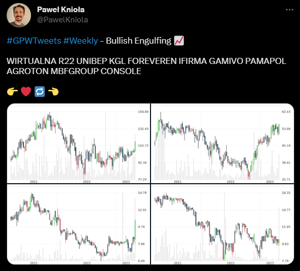

# Volume notifier

[](https://github.com/pawelkn/volume-notifier/actions/workflows/test.yml)

Volume notifier is a scanner of GPW (Warsaw Stock Exchange) securities. Every day checks each company quotations, searching for volume increase and candlestick pattern matches. Scan results are published on twitter.

<p align="center"></p>

## Configuration

Twitter account configuration. To publish a twit, you must create a twitter developer account on https://developer.twitter.com/ and obtain a *Customer Key and Secret*. Then create a twitter application and obtain an *OAuth Access Token and Secret*.

Finally create a configuration file *twitter-credentials.json* and enter your sender account settings.

Example (**twitter-credentials.json**):

```json
{
    "appKey": "<Customer Key>",
    "appSecret": "<Customer Secret>",
    "accessToken": "<OAuth Access Token>",
    "accessSecret": "<OAuth Token Secret>"
}
```

Location of the file can be configured using environment variables

Example:

```sh
export VOLUME_NOTIFIER_TWITTER_CREDENTIALS_FILE=/run/secrets/twitter-credentials
```

Minium volume change, minimum price and minimum daily turnover of scanned securities can by adjusted using environment variables

Example (and default values):

```sh
export VOLUME_NOTIFIER_VOLUME_RISE=2.0
export VOLUME_NOTIFIER_MIN_TURNOVER=50_000
export VOLUME_NOTIFIER_MIN_PRICE=2.0
```

## Run

> ***Note:*** Before run, create a valid [configuration](#Configuration) file: *twitter-credentials.json*

Install dependencies and build application

```sh
npm install
npm run build
```

Application start

```sh
npm start
```

Optional command line options:

* *--dry-run* - do not post anything on twitter, just dummy application run
* *--no-date-check* - do not verify securities last quotation date

## Docker

> ***Note:*** Before run, create a valid [configuration](#Configuration) file: *twitter-credentials.json*

To avoid node version conflict and/or dependencies installation issues, run application in docker container

```sh
docker-compose up --build
```

## Unit tests

Run tests locally

```sh
npm run test
```

or using docker

```sh
docker build -t volume-notifier-test --target test .
docker run --rm volume-notifier-test
```
